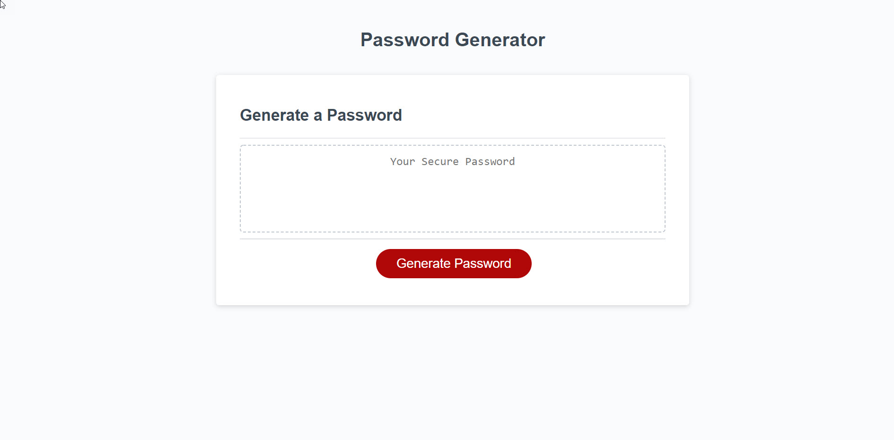

# password-generator

## Description
This is a password generator developed using HTML, CSS, and Javascript. When clicking the Generate Button feature, it will provide a random password that meets the acceptance criteria. It will contain a lowercase, uppercase, symbol and number. I defined these by the use of CharCode.

## Screenshot

